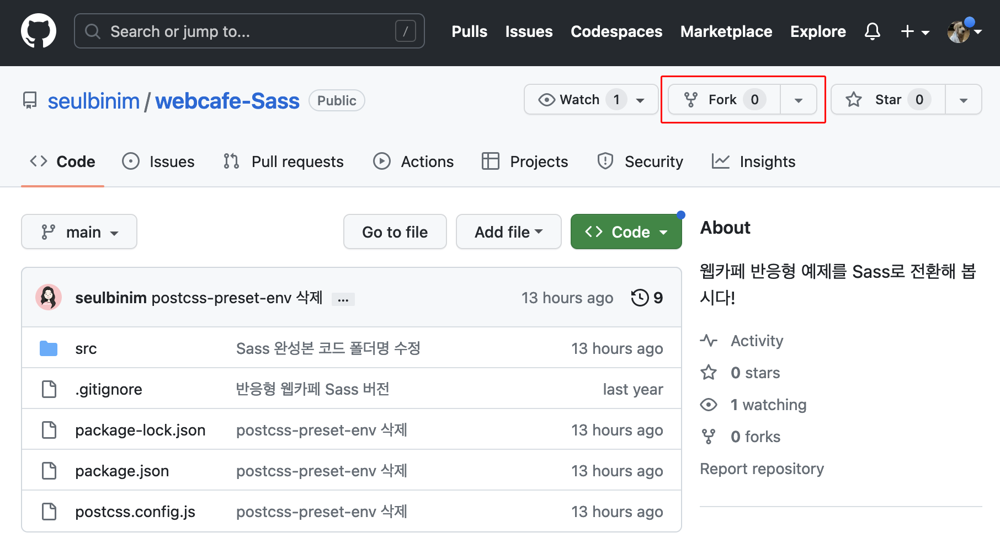
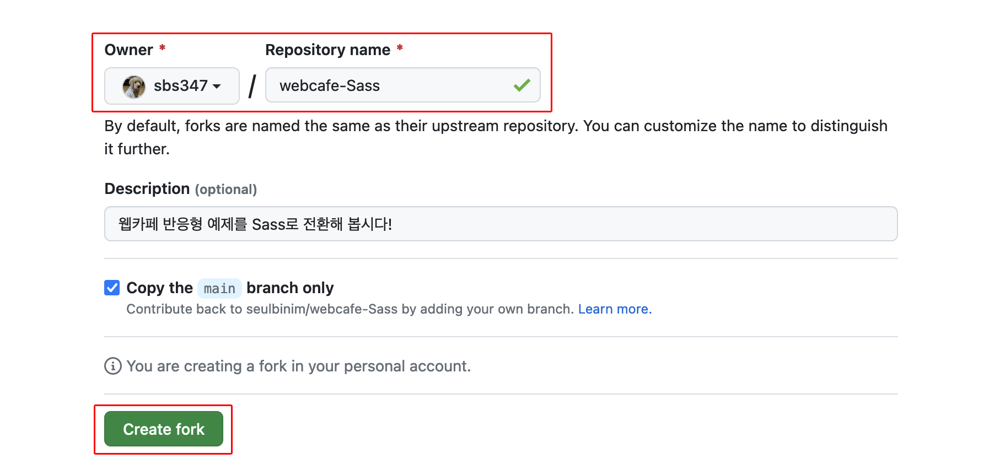

###### EUID ╳ Likelion

# Sass

멋쟁이 사자처럼 프론트엔드 스쿨 Sass 예제 저장소

**학습 저장소 포크(Fork) 및 클론(clone)하기**

  
  


```sh
git clone https://github.com/<본인 Github ID>/webcafe-Sass.git
```

**리모트 저장소 추가 하기**

```sh
git remote add ssam https://github.com/seulbinim/webcafe-Sass.git
```

**패키지 설치 하기**

```sh
npm install
또는
npm i
```

**리모트 저장소 업데이트 하기**

```sh
git remote update
```

**리모트 저장소 또는 모든 브랜치 조회하기**

```sh
git branch -r
git branch -a
```

**리모트 저장소 브랜치 가져오기**

```sh
git checkout -t <리모트 저장소 이름>
git checkout -t ssam/teacher
```

**리모트 브랜치 변경사항 로컬로 가져오기**

```sh
git switch teacher
git pull ssam teacher
```

**로컬 변경사항 리모트로 보내기**

```sh
git switch main
git push origin main
```
